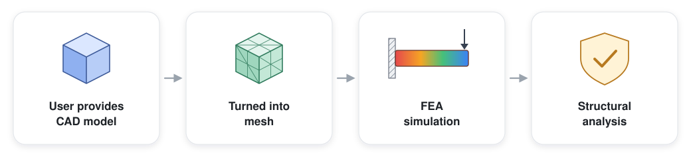

# NASA-STD-5001B in Lean 4

A pipeline that takes a CAD part and a limit load and produces a Lean 4 certificate that the part does, or does not, satisfy the strength requirement of NASA-STD-5001B. Both the FEA simulation's computations and the safety-test computations are checked in Lean.

## Background

NASA's standards set the expectations for how the aerospace industry must design, test and manufacture hardware.

NASA-STD-5001B is NASA's standard for structural design, testing, and service-life requirements for aerospace hardware. It tells us the minimum loads (in terms of design factors and test factors) that parts must withstand to be considered valid.

For example, we might perform a structural analysis of a protoflight nose cone. Protoflight means we intend to use it in flight after the test. Among other things, the standard tells us to test for yield at a load of $1.25\times$ the expected maximum load that will be experienced during flight.

## Why formalise it?

Formalising an engineering standard gives three things:

- **No ambiguity.** The same clauses can be re-implemented throughout a project, organisation, and tools. NASA's standards are used throughout the aerospace industry.
- **Requirements compose.** NASA often has hundreds of engineers working on the same project. They don't all speak to each other and they need to balance their separate design requirements. Formalisation provides a ground truth for those requirements.
- **An explicit boundary of assurance.** Formalisation forces us to specify the boundary of what is proved and what is assumed.

I've formalised the structural analysis tests as in NASA-STD-5001B and verified the correctness of the FEA computation. This is just one part of a much larger system, and so there are still untrusted inputs — e.g. the mesh, boundary conditions and material model still need to be verified and validated.

What formalisation does is make the boundary between what is assumed and what is verified explicit.

## Project

### 1. The NASA standard

I formalised the structural analysis tests in NASA-STD-5001B. The project focuses on §3.2 (Margin of Safety), Table 1 (§4.2.1, minimum design and test factors), and §4.2d:

> "The factored stresses shall not exceed material allowable stresses (yield and ultimate) under the expected temperature, pressure, and other operating conditions."

`NasaStd5001B/Meta.lean` proves properties of the standard itself, including its main correctness theorem:

$$
MS \geq 0 \iff \sigma_{\text{factored}} \leq \sigma_{\text{allowable}}
$$

We also show, for example, that the margin of safety is monotonic — lower stress or a stronger material never results in a lower margin of safety, and a larger design factor never results in a higher one.

### 2. The computation

The stress used in the structural analysis comes from a finite-element analysis (FEA) simulation. The exact physics solver we use is untrusted — the engine might change. We formally verify the correctness of the stress computation that is performed.

Lean assembles the stiffness system $K u = f$ in exact rational arithmetic. The solver (CalculiX) then proposes a solution $u$, and Lean proves that $u$ satisfies the system Lean assembled, to within a tolerance $\varepsilon$. From that verified $u$, Lean computes the stress in every element and takes the maximum. That maximum is the value passed into the structural analysis tests.

By doing this, we split the inputs to the system into the trusted parts (the FEA computation and the structural analysis) and the untrusted parts (everything else — mesh quality, discretisation error, etc.).

## What's next

This is just one part of a much larger system, and so there are still untrusted inputs: the mesh, boundary conditions and material model still need to be verified and validated. This is what the full process would look like:

1. **Formalise the standard and the certified computation** — what this repo is building.
2. **Formalise the meshing process.**
3. **Verify the bound on the error in the FEM output.** There is still an unformalised error between the FEA simulation and reality — the simulation uses a discretised approximation of the real design, and we should make that error formal.
4. **Formalise the design model.** A compositional formal language for the geometry and tolerances of a part, so that e.g. "detrimental yielding" (§3.2) can be decided against the part's own GD&T rather than asserted. I've already worked on formalising the tolerancing half in my own repo, `formal-gdt`.

I've written a short essay discussing this approach at greater length (forthcoming).